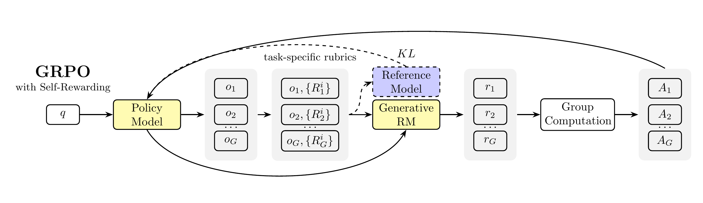
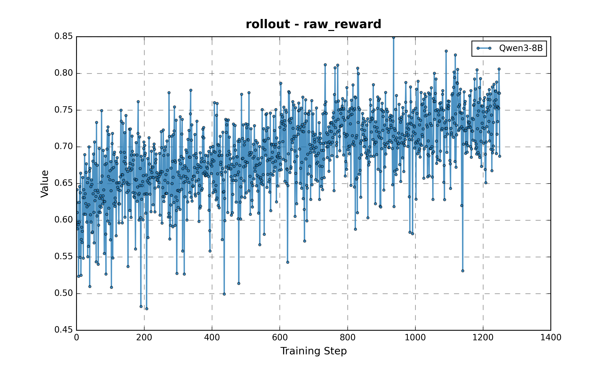
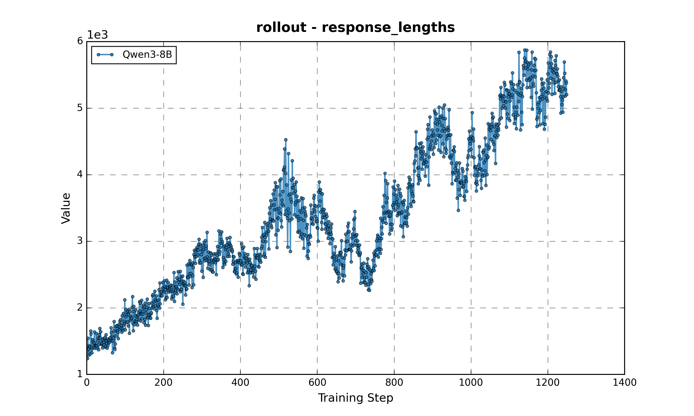
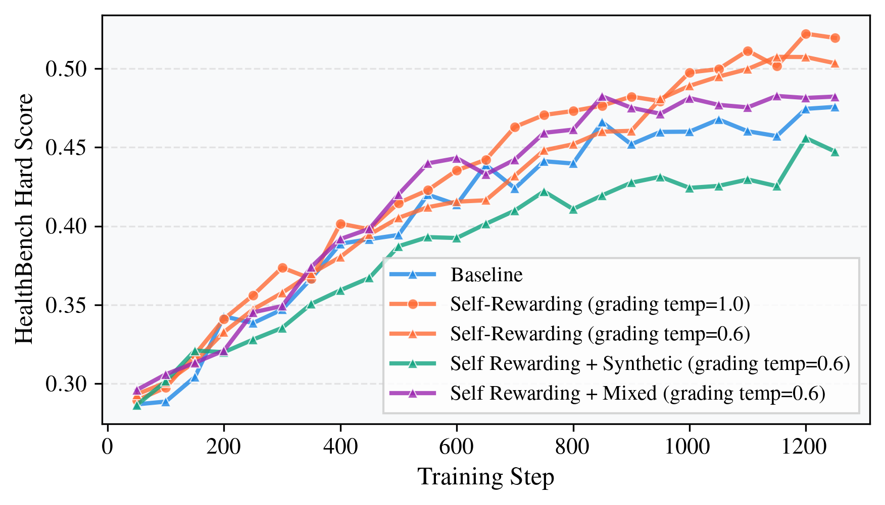

# Self-Rewarding Rubric-Based Reinforcement Learning for Open-Ended Reasoning

[](https://arxiv.org/abs/2509.25534)

Official implementation of **"Self-Rewarding Rubric-Based Reinforcement Learning for Open-Ended Reasoning"** using the [slime](https://github.com/THUDM/slime) framework.

## Overview

This repository implements a self-rewarding reinforcement learning framework where language models serve as both actors and evaluators. The model generates responses and uses rubric-based evaluation to provide reward signals, enabling continuous improvement in reasoning capabilities.



**Key Results:**

- Training Qwen3-32B with just the 4000-sample HealthBench Easy subset achieves performance exceeding **GPT-5** on HealthBench Hard
- Significantly improves both model performance and grading quality
- Resource-efficient approach to enhancing reasoning capabilities

## Quick Start

### 1. Data Preparation

Prepare the HealthBench dataset:

```bash
python data_preprocess.py
```

This script processes the HealthBench dataset and splits it into easy and hard subsets with rubric metadata.

### 2. Training

#### For 8B/32B Models

```bash
# Set required environment variables
export HF_CKPT_PATH=/path/to/your/checkpoint
export DIST_CKPT_PATH=/path/to/dist_ckpt
export PROMPT_DATA_PATH=/path/to/healthbench_easy.jsonl
export SAVE_PATH=/path/to/save/checkpoint

# Run training
bash run_qwen3_8B.sh # or run_qwen3_32B.sh
```

### 3. Evaluation

The results are evaluated using GPT-4.1. Please refer to [simple-evals](https://github.com/openai/simple-evals). As suggested in the paper, capable open-source models such as Qwen3-32B or DeepSeek V3/R1 can also serve as a good grader.

## Results

We report the results on Qwen3-8B using the implementation provided in this repo. For Qwen3-32B, the experiments are conducted with [verl](https://github.com/volcengine/verl).

### Qwen3-8B

<p align="center">
  
</p>

The figure above shows the evolution of raw rewards during training, demonstrating steady improvement in model performance as it learns from self-generated feedback.

<p align="center">
  
</p>

Response length distribution throughout training.

| Model | HealthBench Hard Score |
|-------|------------------------|
| Original Qwen3-8B | 0.1077 |
| Qwen3-8B + Self-Rewarding | 0.3628 |

### Qwen3-32B

HealthBench Hard scores evaluated by Qwen3-32B:



HealthBench Hard scores evaluated by GPT-4.1:

| Model/Method | Score |
|--------------|-------|
| GPT-5 | 0.462 |
| o3 | 0.32 |
| Qwen3-32B (baseline) | 0.147 |
| Qwen3-32B + RL Baseline | 0.446 |
| Qwen3-32B + Self-Rewarding (grading temp=0.6) | 0.486 |
| Qwen3-32B + Self-Rewarding (grading temp=1.0) | **0.500** |

## Citation

If you find this work useful, please cite:

```bibtex
@article{ye2025selfrewarding,
  title={Self-Rewarding Rubric-Based Reinforcement Learning for Open-Ended Reasoning},
  author={Ye, Zhiling and Yue, Yun and Wang, Haowen and Han, Xudong and Jiang, Jiadi and Wei, Cheng and Fan, Lei and Liang, Jiaxin and Zhang, Shuowen and Li, Ji and Guo, Chunxiao and Wang, Jian and Wei, Peng and Gu, Jinjie},
  journal={arXiv preprint arXiv:2509.25534},
  year={2025}
}
```
