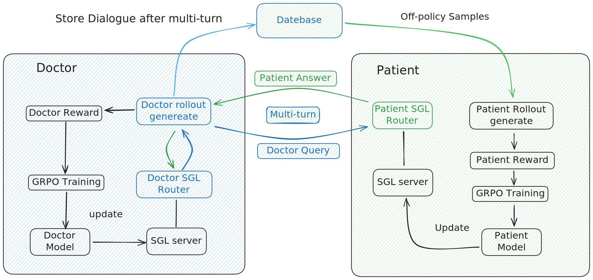
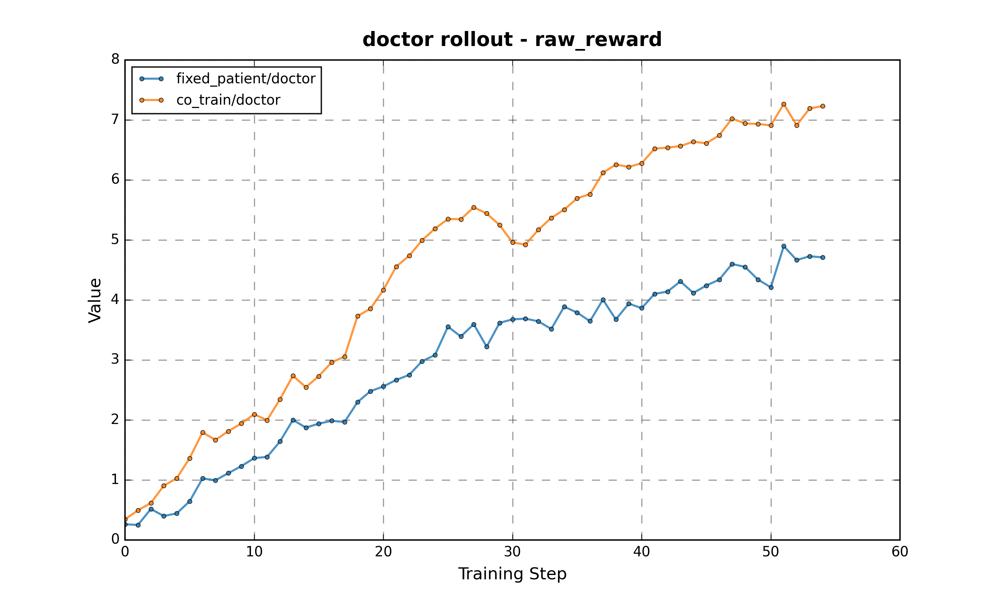
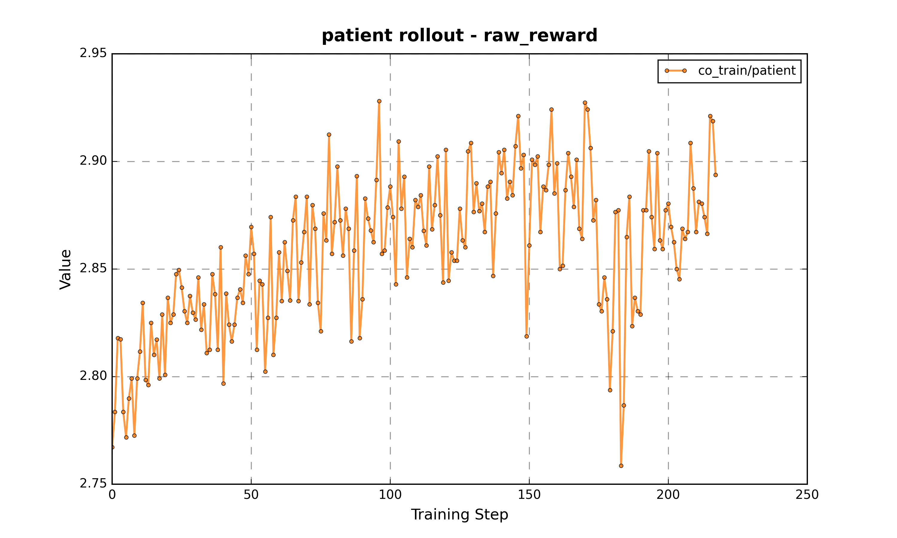

# Takes Two

## (it) Takes Two

We propose a novel reinforcement learning approach based on doctor-patient interactive consultations that simultaneously improves both doctor and patient model capabilities.

In this repository, we demonstrate a workflow using Qwen3-8B as the patient model and Qwen3-32B as the doctor model, performing multi-turn interactions and updating each model through GRPO training with their respective rewards. The main components are:

- Doctor worker: Responsible for conducting multi-turn dialogue simulation by calling the patient model tool and updating the doctor model itself.
- Patient worker: Responsible for updating the patient model and running the database service and SGLang Router service for the doctor worker to store and simulate dialogues. The patient model is updated off-policy using samples stored in the database.



We used the data and doctor/patient reward definitions from [DoctorAgent-RL](https://github.com/JarvisUSTC/DoctorAgent-RL). During training, we observed that through interaction with a fixed patient model, the co-trained doctor model's reward increased significantly, while the patient reward also rose synchronously during the training process. See below for reproducing this training.




## Prerequisite

Use the latest slime docker `slimerl/slime:latest`. Assume your slime dir is in `$SLIME_DIR`

```bash
pip install distro jieba
cd $SLIME_DIR
pip install -e .
```

Soft link `MrlX-TakesTwo` dir into `slime/examples`

```bash
ln -s "<path-to-MrlX-TakesTwo>" $SLIME_DIR/examples/MrlX-TakesTwo
```

## Data

Download the `MTMedDialog_RL` dataset:

```bash
cd data_preprocess
wget https://github.com/JarvisUSTC/DoctorAgent-RL/raw/refs/heads/main/data/MTMedDialog_RL.parquet
python convert_mtmeddialog.py
```

This will convert the `.parquet` file to `MTMedDialog_RL.jsonl` format.

## Run

Submit job to both ray cluster.

```bash
cd $SLIME_DIR/examples/MrlX-TakesTwo

export DATABASE_SERVER_IP=""
export PATIENT_IP=""
export RAY_ADDRESS="" # Dashboard address of the patient or doctor cluster
export DEEPSEEK_R1_API_KEY="" # Patient reward is judged by DeepSeek-R1 in our exp
export DEEPSEEK_R1_BASE_URL=""
export PATIENT_TOKENIZER_PATH="" # Path to the 8B hf ckpt
export KEY_SUFFIX="" # Unique exp name, change it every time
export MAX_TURNS=10
export HF_CKPT_PATH="" # Path to the 8B/32B hf ckpt
export DIST_CKPT_PATH="" # Path to the 8B/32 mcore dist ckpt used by slime
export SAVE_PATH="" # Path to save your model
export PROMPT_DATA_PATH="" # Path to MTMedDialog_RL.jsonl generated before
bash run.sh patient # or doctor
```

## Notes

Doctor messages structure:

1. user <- prompt containing chief complaint
2. assistant <- this is doctor
3. user
4. ...

Patient messages structure:

1. system <- prompt containing chief complaint and self reports
2. user <- this is doctor
3. assistant <- patient
4. ...

We use a custom Qwen3 chat template (`chat_template/qwen3_assistant_mask.jinja`) to remove reasoning content from user role.

## Log Plot

```bash
python log_plot.py --input-log "<path-to-your-log>"
```
