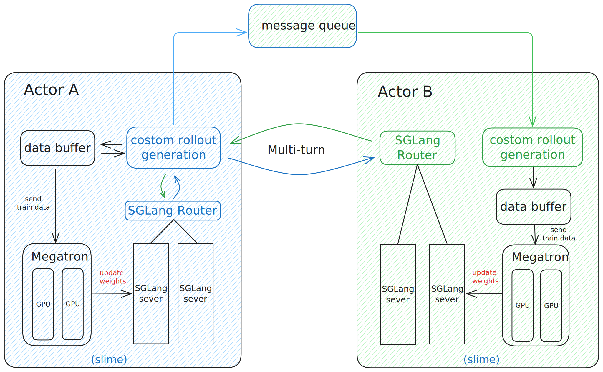

# MrlX 

多智能体强化学习框架

在 MrlX 中，Agent A 与 Agent B 作为独立智能体，通过消息队列实现跨智能体的 API 通信，将内部逻辑抽象为外部请求，支持多轮（Multi-turn）交互、推理结果传递与协同决策。

运行时，Agent A 发起多轮对话生成，Agent B 同样以多轮响应方式参与交互；协作模块评估双方对话并计算双侧奖励，经消息队列驱动迭代。每个智能体均保持完整的训推闭环：由 data buffer 管理样本，SGLang Router 调度推理任务，Megatron 执行训练，形成“生成→训练→同步”的飞轮机制。

训练数据流入 Megatron 更新权重并同步回推理服务，实现知识在智能体间的高效流动与持续协同进化，突破单任务限制，支持多智能体在动态环境中持续提升整体决策能力。

## 目录

- [架构总览](#架构总览)
- [应用案例](#应用案例)
  - [MrlX-TakesTwo](#MrlX-TakesTwo)
  - [MrlX-DeepResearch](#MrlX-DeepResearch)
- [致谢](#致谢)

## 架构总览

    

**模块说明**

- **training (Megatron)**：负责训练流程，从 data Buffer 读取数据，训练完后将参数同步至 rollout 模块
- **rollout (SGLang + router)**：生成新数据（含 reward/verifier），存储至 data buffer
- **data buffer**：桥梁模块，管理 prompt 初始化、自定义数据与 rollout 生成方法
- **custom rollout generation**：实现自定义数据生成逻辑，可针对特定场景或任务调整多轮交互策略、生成格式
- **message queue**：负责在 Agent A 与 Agent B 之间传递多轮交互信息，支持跨智能体 API 通信、任务分发与状态同步，驱动闭环迭代运行

## 应用案例

### MrlX-TakesTwo
参考 [MrlX-TakesTwo](MrlX-TakesTwo/README.md)

### MrlX-DeepResearch
参考 [MrlX-DeepResearch](MrlX-DeepResearch/README_QUICKSTART_zh.md)

## 致谢

- 特别感谢以下项目 & 社区：slime、SGLang、Megatron‑LM等。