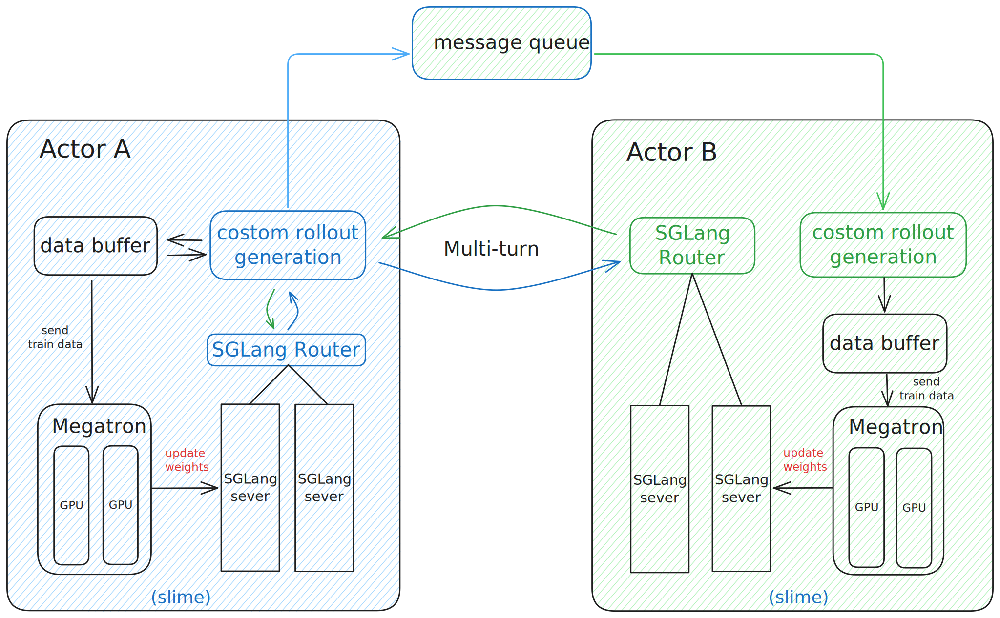
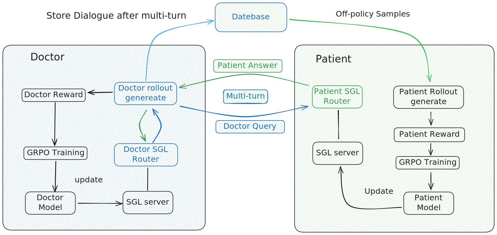
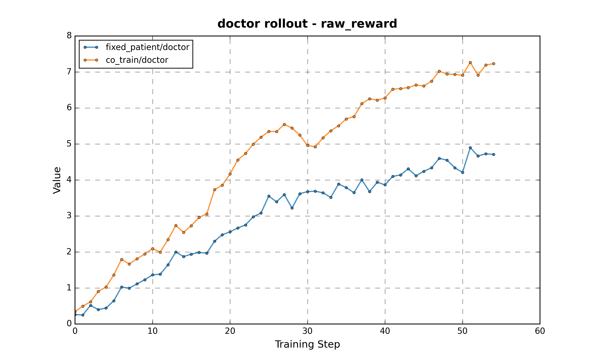
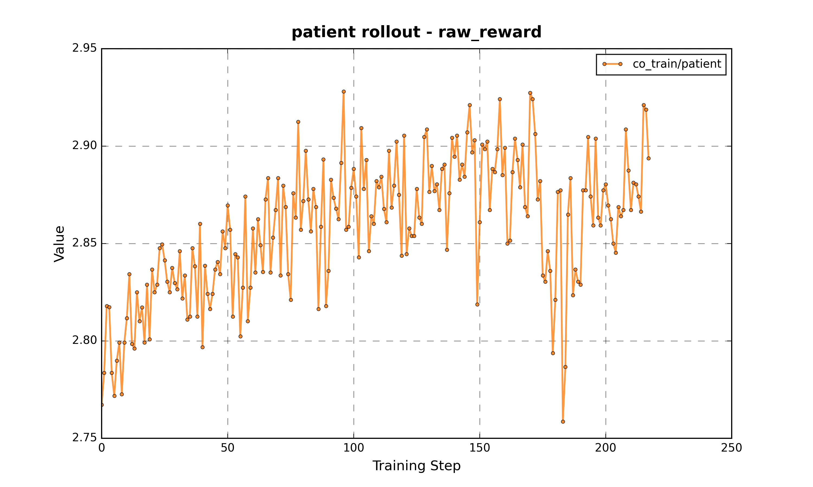
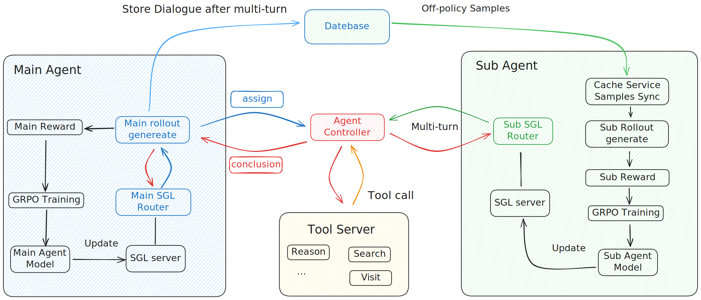
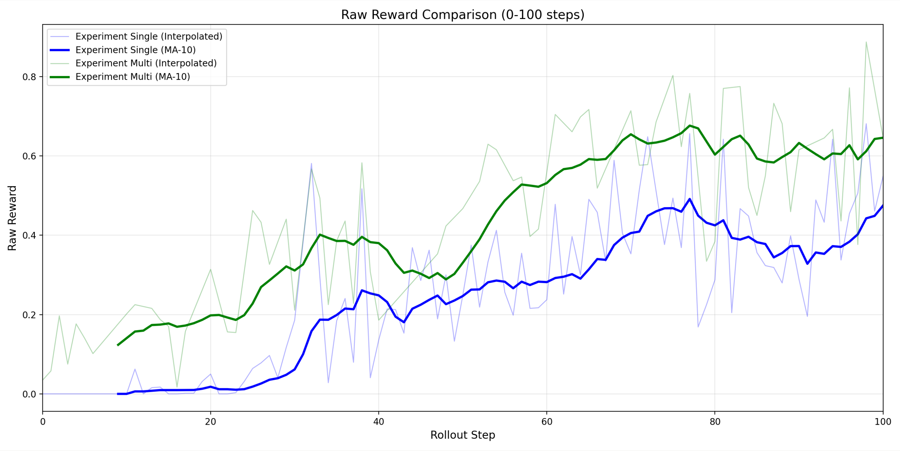
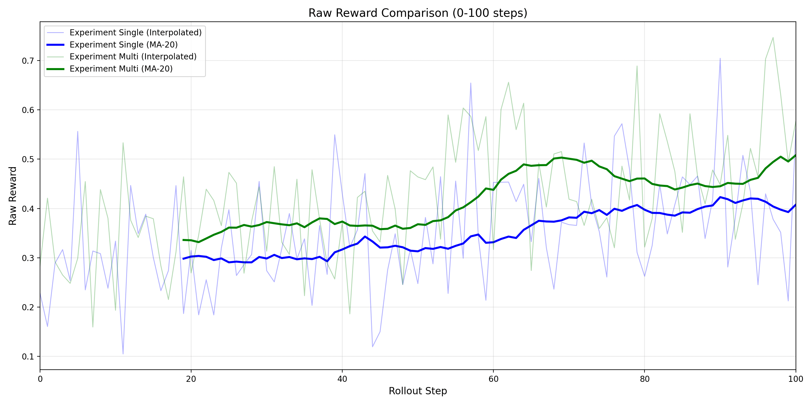

# MrlX: A Multi-Agent Reinforcement Learning Framework

## Abstract

To address the challenge of enabling large-scale models to reason, act, and learn collectively, we introduce **MrlX**, a novel asynchronous co-evolutionary framework designed for Large Language Model (LLM) agents. This framework establishes a symbiotic relationship between an on-policy explorer and an off-policy adapter, facilitating rapid and stable capability enhancement through continuous mutual improvement. We demonstrate the efficacy of MrlX through two case studies: a doctor-patient co-training simulation for diagnostic interviewing and a multi-agent research pipeline. In both scenarios, the multi-agent approach significantly outperforms single-agent baselines, showcasing the framework's potential in complex, collaborative tasks.

    

## Core Architecture

At the heart of this architecture are two distinct roles:

*   The **On-policy Explorer (Actor A)** serves as the primary driver of innovation. It is responsible for initiating real-time interactions and making on-the-fly decisions.
*   The **Off-policy Adapter (Actor B)** focuses on rapid adaptation. With just a one-step delay, it learns from the complete interaction just concluded by both agents, enabling it to iterate and improve its capabilities almost instantaneously.

This architecture creates a highly efficient and stable learning system where the two agents act as stepping stones for one another. The result is a synergistic, upward spiral of capabilities driven by continuous co-evolution.

Drawing upon this multi-agent coordinated training framework, we have implemented and validated it across multiple domains. Two illustrative case studies are presented below.

## Case Study: itTakesTwo (Doctor-Patient Co-Training)

[Project Link: MrlX-TakesTwo](../MrlX-TakesTwo/README.md)

    

### Overview

In the context of clinical diagnosis, where effective patient interviewing is pivotal, conventional self-play paradigms that only update the clinician agent are insufficient. Such approaches miss the mutual gains achievable when the patient simulator also evolves. Our work demonstrates that co-training both clinician and patient agents via joint multi-agent reinforcement learning markedly outperforms clinician-only training. This underscores the necessity of co-evolving all interacting agents to enhance the performance of LLM-driven diagnostic interviewing.

### Implementation Details

- **Qwen3-8B** → patient agent  
- **Qwen3-32B** → doctor agent  
- **GRPO** updates both agents across multi-turn consultations  
- **DeepSeek-R1** → scores empathy/adherence for patient updates  
- **DoctorAgent-RL** → tracks diagnostic accuracy for clinician responses  

### Results

As illustrated by the reward curves below, the joint training methodology produces significant improvements for both agents compared to the clinician-only baseline. This highlights the value of co-evolving patient simulators to achieve superior diagnostic interviewing capabilities in LLMs.

    
    

### General Observation
Results from the doctor-patient co-training show that mutual asynchronous evolution of the participating interactive agents yields measurable gains over single-agent training.  
Building on this finding, we next explore a domain with distinct challenges—context-length explosion and frequent multi-tool usage—addressed through MrlX's multi-agent research pipeline.

---

## Case Study: DeepResearch

[Project Link: MrlX-DeepResearch](../MrlX-DeepResearch/README_QUICKSTART.md)

    

### Overview

In complex reasoning tasks requiring external tool usage, single-agent LLM systems face a context length explosion because the continuous history of tool interactions, verbose outputs, and intermediate reasoning steps rapidly accumulates, overwhelming the model's finite context window. Our work adopts a multi-agent architecture where distinct LLMs specialize in separate roles while training separately at the same time, enabling them to interact and dynamically generate training samples for one another. This co-evolutionary process allows each agent to deepen its expertise on its specific task, a clear departure from single-model approaches that simulate roles.

### Implementation Details

- **Qwen3-30B-A3B-Instruct-2507** for both main and sub agent
- **GRPO** updates both agents via GRPO
- **DeepSeek-R1** act final summary actions in Agent Controller, Sub Agent Reward scorer
- **Session-RL** moderate complexity for session 1 steps, learn tool call formatting and basic reasoning. high complexity for session 2 steps, selected low-success queries for generalization.
- **Reward-Design** zero reward if any incorrect format in trajectory. Main Agent reward is based on end-to-end accuracy, while Sub Agent is based on the corresponding main reward replication and LLM scoring.

### Results

The results demonstrate that our multi-agent setup with distinct, specialized LLMs (green line) converges faster and achieves higher rewards than a single-agent baseline configuration (blue line).

As the single-agent baseline configuration slightly difffers from the multi-agent setup, the initial rewards are inconsistent. More rigorous ablation study will be presented in the following paper.

    
    

---

## Summary & Outlook
The case studies confirm that asynchronous co-evolution of specialized LLM agents delivers measurable gains in stability, convergence speed, and task performance over single-agent approaches.  
Looking forward, MrlX will be extended to more diverse multi-agent ecosystems beyond LLMs, and adapted for real-time dynamic environments with potential self-organizing role allocation mechanisms.

## Acknowledgements

- Special thanks to the following projects & communities: slime, SGLang, Megatron-LM, and others.